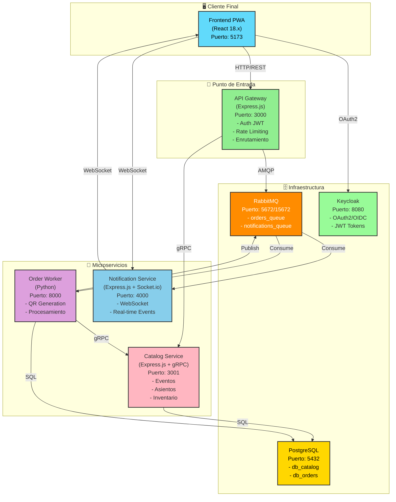
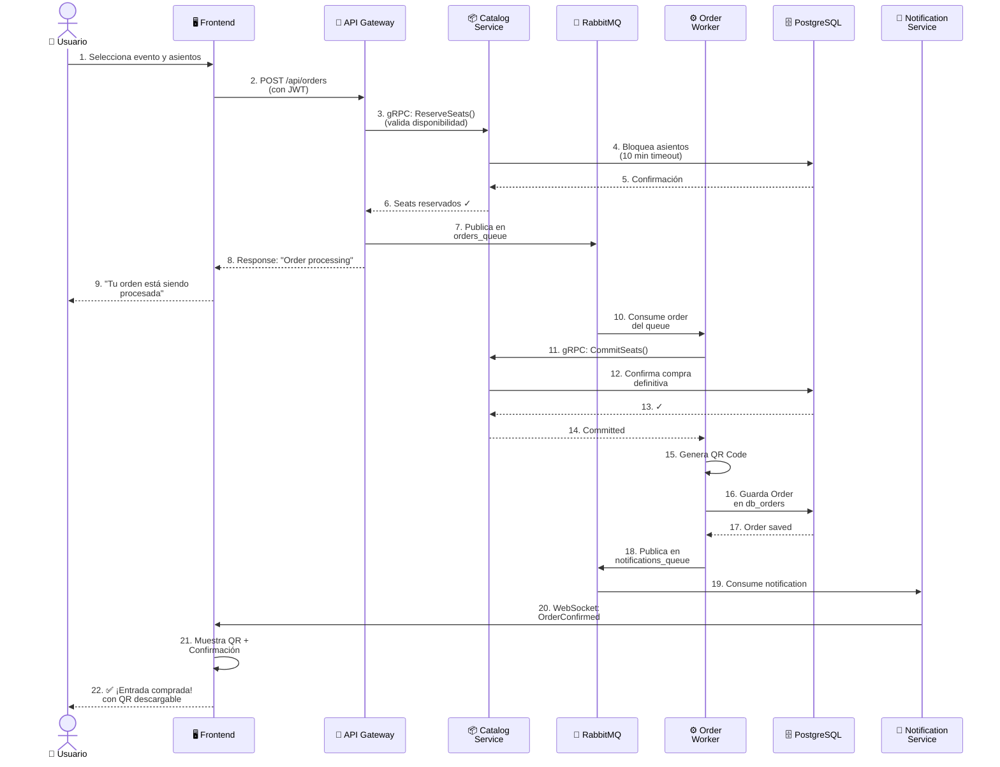
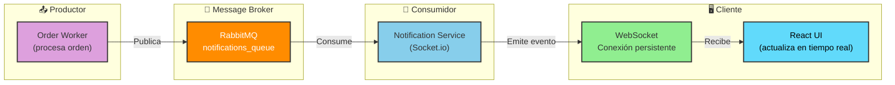
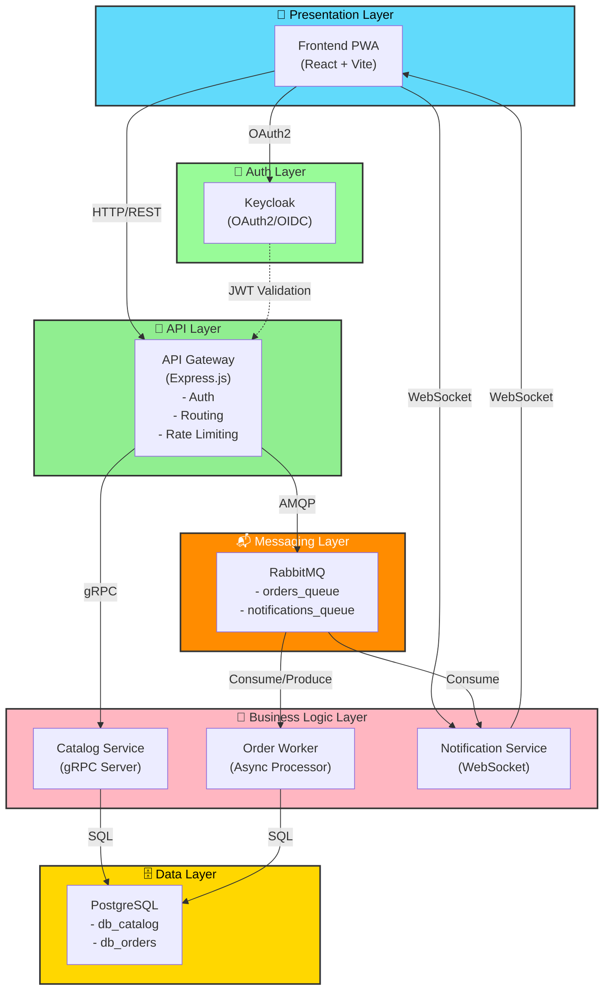
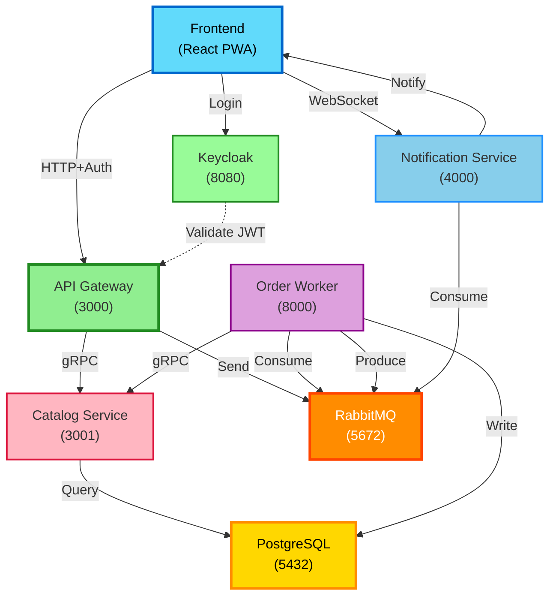
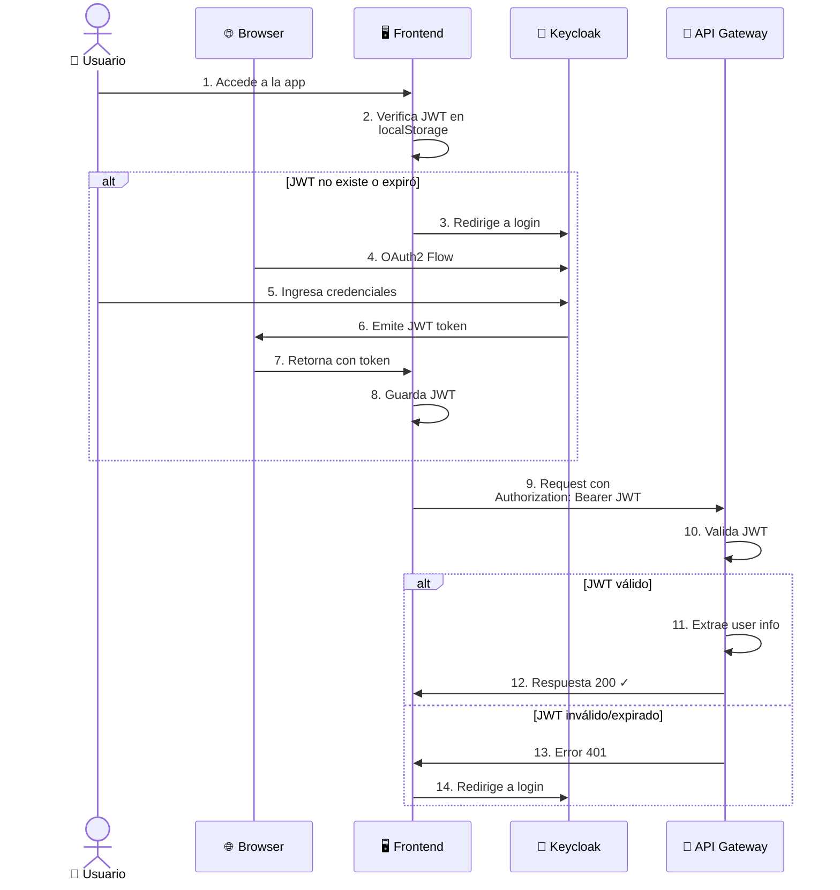
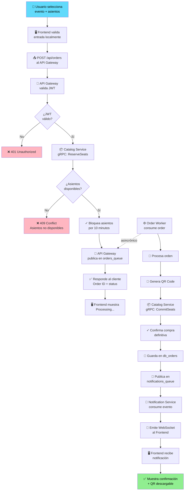
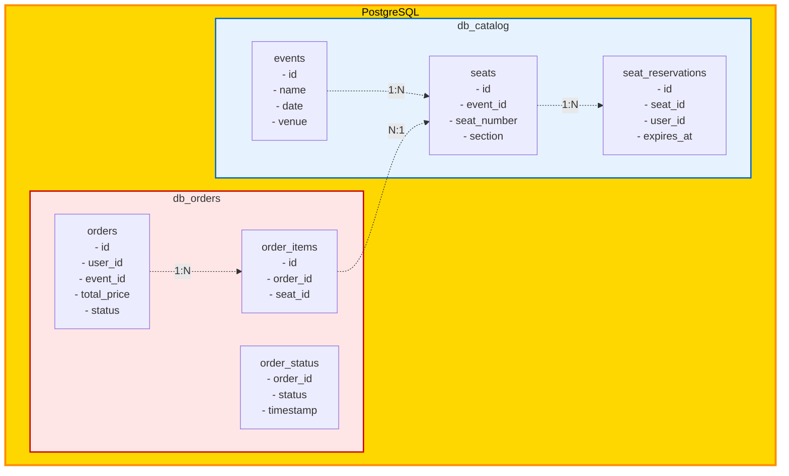
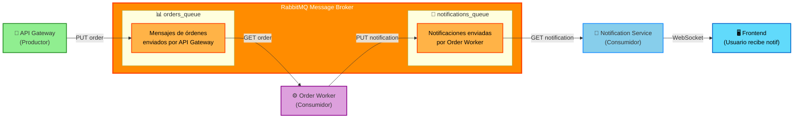
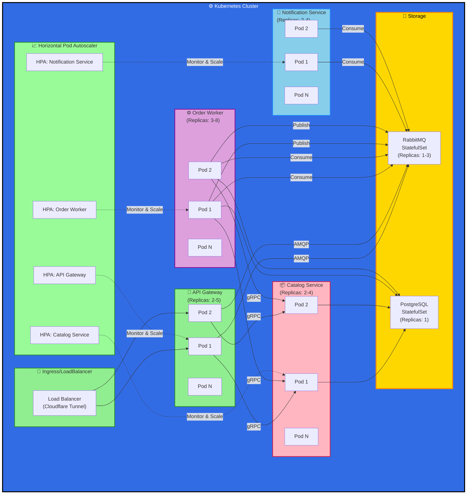

# TicketBuster - Diagramas de Microservicios (Mermaid)

## 1. Arquitectura General del Sistema

---

## 2. Flujo Completo de Compra de Entrada

---

## 3. Flujo de Notificaciones en Tiempo Real

---

## 4. Capas de la Arquitectura

---

## 5. Dependencias Entre Servicios

---

## 6. Flujo de Autenticación con Keycloak

---

## 7. Procesamiento de Órdenes (Detallado)

---

## 8. Estructura de Bases de Datos

---

## 9. RabbitMQ - Message Flow

---

## 10. Escalabilidad en Kubernetes

---

## 📋 Leyenda de Colores

| Color | Componente |
|-------|-----------|
| 🔵 Azul Claro | Frontend (React) |
| 🟢 Verde | API Gateway |
| 🔴 Rosa | Catalog Service |
| 🟣 Púrpura | Order Worker |
| 🔵 Azul | Notification Service |
| 🟡 Amarillo | PostgreSQL |
| 🟠 Naranja | RabbitMQ |
| 🟢 Verde Claro | Keycloak |

---

## 🔑 Referencias Rápidas

### Puertos
- **Frontend**: 5173 (dev), 80/443 (prod)
- **API Gateway**: 3000
- **Catalog Service**: 3001
- **Notification Service**: 4000
- **Order Worker**: 8000
- **PostgreSQL**: 5432
- **RabbitMQ**: 5672 (AMQP), 15672 (Management UI)
- **Keycloak**: 8080

### Protocolos
- **HTTP/REST**: Frontend ↔ API Gateway
- **gRPC**: API Gateway ↔ Catalog Service, Order Worker ↔ Catalog Service
- **AMQP**: API Gateway/Order Worker ↔ RabbitMQ
- **WebSocket**: Notification Service ↔ Frontend
- **TCP**: Todos ↔ PostgreSQL

### Colas RabbitMQ
- `orders_queue`: API Gateway → Order Worker
- `notifications_queue`: Order Worker → Notification Service
