# TicketBuster - Diagramas de Microservicios (Mermaid)

## 1. Arquitectura General del Sistema

---

## 2. Flujo Completo de Compra de Entrada

---

## 3. Flujo de Notificaciones en Tiempo Real

```mermaid
graph LR
    subgraph Producer["📤 Productor"]
        OW["Order Worker<br/>(procesa orden)"]
    end
    
    subgraph Queue["📨 Message Broker"]
        NQ["RabbitMQ<br/>notifications_queue"]
    end
    
    subgraph Consumer["🔔 Consumidor"]
        NS["Notification Service<br/>(Socket.io)"]
    end
    
    subgraph Client["🖥️ Cliente"]
        WS["WebSocket<br/>Conexión persistente"]
        UI["React UI<br/>(actualiza en tiempo real)"]
    end
    
    OW -->|Publica| NQ
    NQ -->|Consume| NS
    NS -->|Emite evento| WS
    WS -->|Recibe| UI
    
    style OW fill:#DDA0DD,stroke:#333,stroke-width:2px
    style NQ fill:#FF8C00,stroke:#333,stroke-width:2px,color:#fff
    style NS fill:#87CEEB,stroke:#333,stroke-width:2px
    style WS fill:#90EE90,stroke:#333,stroke-width:2px
    style UI fill:#61DAFB,stroke:#333,stroke-width:2px,color:#000
```

---

## 4. Capas de la Arquitectura

---

## 5. Dependencias Entre Servicios

---

## 6. Flujo de Autenticación con Keycloak

```mermaid
sequenceDiagram
    actor User as 👤 Usuario
    participant Browser as 🌐 Browser
    participant FE as 🖥️ Frontend
    participant KC as 🔐 Keycloak
    participant AG as 🚪 API Gateway
    
    User->>FE: 1. Accede a la app
    FE->>FE: 2. Verifica JWT en<br/>localStorage
    
    alt JWT no existe o expiró
        FE->>KC: 3. Redirige a login
        Browser->>KC: 4. OAuth2 Flow
        User->>KC: 5. Ingresa credenciales
        KC->>Browser: 6. Emite JWT token
        Browser->>FE: 7. Retorna con token
        FE->>FE: 8. Guarda JWT
    end
    
    FE->>AG: 9. Request con<br/>Authorization: Bearer JWT
    AG->>AG: 10. Valida JWT
    
    alt JWT válido
        AG->>AG: 11. Extrae user info
        AG->>FE: 12. Respuesta 200 ✓
    else JWT inválido/expirado
        AG->>FE: 13. Error 401
        FE->>KC: 14. Redirige a login
    end
```

---

## 7. Procesamiento de Órdenes (Detallado)

```mermaid
flowchart TD
    A["👤 Usuario selecciona<br/>evento + asientos"] --> B["🖥️ Frontend valida<br/>entrada localmente"]
    B --> C["📤 POST /api/orders<br/>al API Gateway"]
    C --> D["🔐 API Gateway<br/>valida JWT"]
    
    D --> E{"¿JWT<br/>válido?"} 
    E -->|No| F["❌ 401 Unauthorized"]
    E -->|Sí| G["📦 Catalog Service<br/>gRPC: ReserveSeats"]
    
    G --> H{"¿Asientos<br/>disponibles?"} 
    H -->|No| I["❌ 409 Conflict<br/>Asientos no disponibles"]
    H -->|Sí| J["✓ Bloquea asientos<br/>por 10 minutos"]
    
    J --> K["📨 API Gateway<br/>publica en orders_queue"]
    K --> L["✅ Responde al cliente<br/>Order ID + status"]
    L --> M["🖥️ Frontend muestra<br/>Processing..."]
    
    N["⚙️ Order Worker<br/>consume order"] -.->|asincrónico| K
    N --> O["💾 Procesa orden"]
    O --> P["🎫 Genera QR Code"]
    P --> Q["📦 Catalog Service<br/>gRPC: CommitSeats"]
    Q --> R["✓ Confirma compra<br/>definitiva"]
    R --> S["💾 Guarda en db_orders"]
    S --> T["📨 Publica en<br/>notifications_queue"]
    
    T --> U["🔔 Notification Service<br/>consume evento"]
    U --> V["📱 Emite WebSocket<br/>al Frontend"]
    V --> W["🖥️ Frontend recibe<br/>notificación"]
    W --> X["✅ Muestra confirmación<br/>+ QR descargable"]
    
    style A fill:#61DAFB,color:#000
    style X fill:#90EE90,color:#000
    style F fill:#FFB6C1
    style I fill:#FFB6C1
```

---

## 8. Estructura de Bases de Datos

---

## 9. RabbitMQ - Message Flow

```mermaid
graph LR
    subgraph RMQ["RabbitMQ Message Broker"]
        subgraph OrdersQ["📊 orders_queue"]
            OQ["Mensajes de órdenes<br/>enviados por API Gateway"]
        end
        
        subgraph NotifQ["📣 notifications_queue"]
            NQ["Notificaciones enviadas<br/>por Order Worker"]
        end
    end
    
    AG["🚪 API Gateway<br/>(Productor)"] -->|PUT order| OQ
    OQ -->|GET order| OW["⚙️ Order Worker<br/>(Consumidor)"]
    OW -->|PUT notification| NQ
    NQ -->|GET notification| NS["🔔 Notification Service<br/>(Consumidor)"]
    NS -->|WebSocket| FE["🖥️ Frontend<br/>(Usuario recibe notif)"]
    
    style RMQ fill:#FF8C00,stroke:#FF4500,stroke-width:3px,color:#fff
    style OQ fill:#FFB347,stroke:#FF4500,stroke-width:2px,color:#000
    style NQ fill:#FFB347,stroke:#FF4500,stroke-width:2px,color:#000
    style AG fill:#90EE90,stroke:#228B22,stroke-width:2px
    style OW fill:#DDA0DD,stroke:#8B008B,stroke-width:2px
    style NS fill:#87CEEB,stroke:#1E90FF,stroke-width:2px
    style FE fill:#61DAFB,stroke:#0066cc,stroke-width:2px,color:#000
```

---

## 10. Escalabilidad en Kubernetes

---

## 📋 Leyenda de Colores

| Color | Componente |
|-------|-----------|
| 🔵 Azul Claro | Frontend (React) |
| 🟢 Verde | API Gateway |
| 🔴 Rosa | Catalog Service |
| 🟣 Púrpura | Order Worker |
| 🔵 Azul | Notification Service |
| 🟡 Amarillo | PostgreSQL |
| 🟠 Naranja | RabbitMQ |
| 🟢 Verde Claro | Keycloak |

---

## 🔑 Referencias Rápidas

### Puertos
- **Frontend**: 5173 (dev), 80/443 (prod)
- **API Gateway**: 3000
- **Catalog Service**: 3001
- **Notification Service**: 4000
- **Order Worker**: 8000
- **PostgreSQL**: 5432
- **RabbitMQ**: 5672 (AMQP), 15672 (Management UI)
- **Keycloak**: 8080

### Protocolos
- **HTTP/REST**: Frontend ↔ API Gateway
- **gRPC**: API Gateway ↔ Catalog Service, Order Worker ↔ Catalog Service
- **AMQP**: API Gateway/Order Worker ↔ RabbitMQ
- **WebSocket**: Notification Service ↔ Frontend
- **TCP**: Todos ↔ PostgreSQL

### Colas RabbitMQ
- `orders_queue`: API Gateway → Order Worker
- `notifications_queue`: Order Worker → Notification Service
